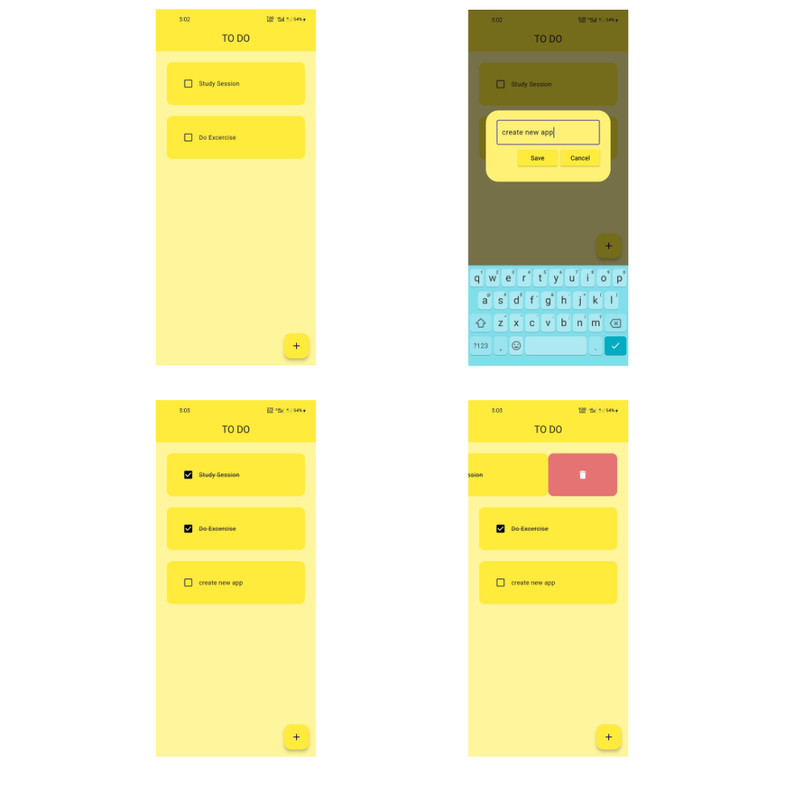

# Flutter To-Do App

## Goals:
- Build a functional to-do list application using Flutter.
- Apply knowledge of state management and UI design.

### Project Overview:
In Week 3, First Project i created a to-do list application to practice state management and UI design in Flutter. The app allows users to add, complete, and delete tasks. Here are the main features:

#### Task List:
- Display a list of tasks with checkboxes to mark them as complete.
- Tasks are displayed with a striking through text style when completed.
- Underline added after each checkbox.

#### Add Task:
- Floating action button to add new tasks.
- Dialog box to input task details.

#### Delete Task:
- Swipe to delete tasks using the `flutter_slidable` package.
- Confirmation for deletion with custom styling.

### Here is the ScreenShots

